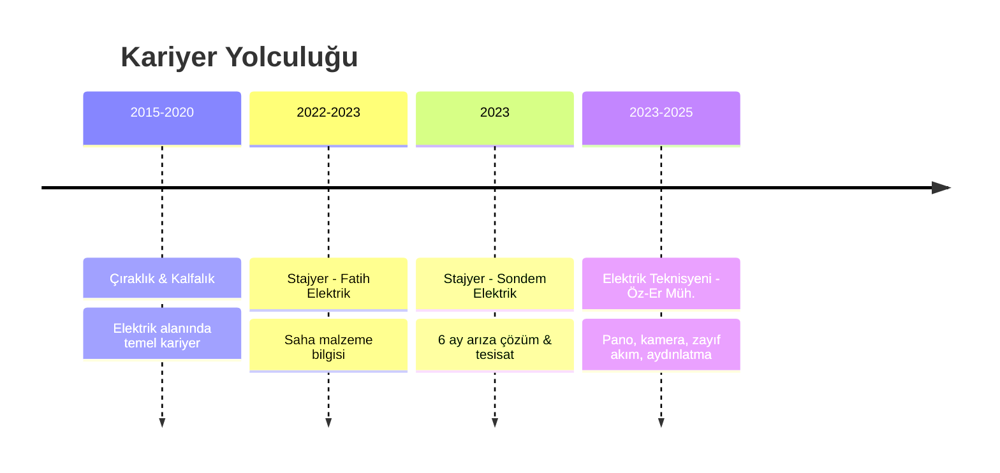

  <picture>
    <source media="(prefers-color-scheme: dark)" srcset="https://capsule-render.vercel.app/api?type=shark&height=320&color=gradient&customColorList=0,2,2,5,30&text=MUHAMMET%20ENES%20EVC%C4%B0&fontSize=44&fontAlignY=28&animation=twinkling&desc=%E2%9A%A1%20Elektrik%20Teknisyeni%20%7C%20Kontrol%20ve%20Otomasyon%20%7C%20Yaz%C4%B1l%C4%B1m%20Geli%C5%9Ftirici%20%E2%9A%A1&descSize=15&descAlignY=52" />
    <source media="(prefers-color-scheme: light)" srcset="https://capsule-render.vercel.app/api?type=shark&height=320&color=gradient&customColorList=1,3,12,24&text=MUHAMMET%20ENES%20EVC%C4%B0&fontSize=44&fontAlignY=28&animation=twinkling&desc=%E2%9A%A1%20Elektrik%20Teknisyeni%20%7C%20Kontrol%20ve%20Otomasyon%20%7C%20Yaz%C4%B1l%C4%B1m%20Geli%C5%9Ftirici%20%E2%9A%A1&descSize=15&descAlignY=52" />
    
  </picture>

 

  
  
  
  
   
  
  

---

<table align="center">
  <tr>
    <td align="center" width="96">
      
       Özet
    </td>
    <td align="center" width="96">
      
       Eğitim
    </td>
    <td align="center" width="96">
      
       Deneyim
    </td>
    <td align="center" width="96">
      
       Beceriler
    </td>
    <td align="center" width="96">
      
       Sertifikalar
    </td>
    <td align="center" width="96">
      
       Projeler
    </td>
    <td align="center" width="96">
      
       Referanslar
    </td>
  </tr>
</table>

---

<h2 align="center">🧑‍💻 Kişisel Özet</h2>

  <pre style="background:#0d1117; padding: 20px; border-radius: 10px; border: 1px solid #30363d; text-align: left; display: inline-block;">
profil:
  ad: Muhammet Enes
  soyad: Evci
  ünvan: Elektrik Teknisyeni &amp; Yazılım Geliştirici
  konum: Ankara, Türkiye

eğitim:
  - Kırıkkale Üniversitesi → Kontrol ve Otomasyon Teknolojisi
  - Abidinpaşa MTAL → Elektrik Pano Montörlüğü

deneyim:
  elektrik: 10+ yıl (Çıraklık → Kalfalık → Teknisyenlik)
  yazılım: 1+ yıl (Mobil, Gömülü, AI)

odak_alanları: [Gömülü Sistemler, IoT, Mobil Uygulama, Yapay Zeka]

hedef: "Teorik bilgiyi saha pratiğiyle harmanlayarak
          değer üreten çözümler geliştirmek"
  </pre>

---

<h2 align="center">🎓 Eğitim</h2>

| | Derece | Kurum | Bölüm | Yıl |
|:-:|:------:|:-----:|:-----:|:---:|
| 🎓 | **Ön Lisans** | **Kırıkkale Üniversitesi** | Kontrol ve Otomasyon Teknolojisi | `2024 – 2026` |
| 🏫 | **Lise** | **Abidinpaşa MTAL** | Elektrik / Pano Montörlüğü | `2019 – 2023` |

---

<h2 align="center">💼 İş Deneyimi</h2>

| Dönem | Pozisyon | Şirket | Açıklama |
|:-----:|:--------:|:------:|:---------|
| 🛠️ `2023 – 2025` | **Elektrik Teknisyeni** | Öz-Er Mühendislik | Pano kurulum/reglaj, kamera sistemleri, zayıf akım, kablaj, aydınlatma ve arıza çözümleri |
| 🔧 `2023` | **Stajyer** | Sondem Elektrik / Ankara | 6 ay saha deneyimi, arıza tespit ve giderme, tesisat uygulamaları |
| 🔧 `2022 – 2023` | **Stajyer** | Fatih Elektrik Aydınlatma / Ankara Ulus | Saha uygulamaları, malzeme bilgisi |
| ⚡ `2015 – 2020` | **Çırak – Kalfa** | Çeşitli Firmalar | Mesleki temel eğitim ve uygulama |

---

<h2 align="center">🛠️ Teknik Yetkinlikler</h2>

### ⚡ Pano & Elektrik

![Motor Devreleri](https://img.shields.io/badge/Motor_Devreleri-555?style=for-the-badge&logo=data:image/svg%2bxml;base64,PHN2ZyB4bWxucz0iaHR0cDovL3d3dy53My5vcmcvMjAwMC9zdmciIHdpZHRoPSIxNiIgaGVpZ2h0PSIxNiIgZmlsbD0iI2ZmZiIgY2xhc3M9ImJpIGJpLXNlcnZvLW1vdG9yLWZpbGwiIHZpZXdCb3g9IjAgMCAxNiAxNiI+PHBhdGggZD0iTTkgM2MtMS4zNS4wNjMtMi4wMzguNzk3LTIuOTY0IDJsLjA5LjA4Yy0uNTIzLjU0Ny0uODUzIDEuMTg1LTEuMjA2IDEuODE3bC0uMDc4LjE1Yy0uNTQ4LjU0Ny0xLjE4Ny44NzgtMS44MjEgMS4yMjhsLS4wNzQuMDQzYzAgLjYyNS4wNjIgMS4yNjEuMzE2IDEuNzg0bC4wMzMuMDdjLjI1My41MjMuNzIuOTUyIDEuMjQyIDEuMjMybC4xNTQuMDg2Yy0uMDc4LjM5MS0uMTUzLjc4Mi0uMjI3IDEuMTczbC0uMDM2LjE4Yy0uMDUuMjM3LS4wOTcuNDczLS4xNDQuNzA5bC0uMDI1LjEzNWMtLjE5MyAxLjA3LS4yNDMgMS44NzUtLjA4NSAyLjQ2Ny4zMzYgMS4yNjYuOTgyIDIuMjUyIDIuMTMgMi41OTRhMS44IDEuOCAwIDAgMCAuNDcuMDc0Yy41NTcuMDYyIDEuMjE44oCTIDEuMDQzIDIuMDY2bC0uMzI4LS4wNDZhMi4wNiAyLjA2IDAgMCAwLS42MTQuMDE1Yy0uNjQzLjEwNi0xLjA5Ny4zODEtMS4zNC42NjctLjI0LjI4Mi0uMzM2LjYxLS4zNjIuOTM2YTEuNyAxLjcgMCAwIDAgLjA0NC40MzhsLjA1LjI3N2MuMDYuMzMyLjE2LjY4LjI5MiAxLjAzNkw5IDUuMjRjLS4xMzctLjM3My0uMjUtLjc1LS4zMTMtMS4xMmwtLjAyNS0uMTQ1QzguNTI4IDMuMzkgOC4zMDQgMi44MjYgOSAyLjl2LS4wMDVMOSAzem0tMyAxYy0uNjkgMC0xLjI1LjU2LTEuMjUgMS4yNXYzLjE3NWEzLjggMy44IDAgMCAxIDEuMjA2LS4zMTcgMS4zIDEuMyAwIDAgMC0uNDY0LS4yNjRsLS4zMDQtLjExN2EuNjUuNjUgMCAwIDEtLjQzOC0uNjE1VjQuMjVhLjI1LjI1IDAgMCAxIC4yNS0uMjV6bTIuNTQ3IDIuODQzYTIuMyAyLjMgMCAwIDAtLjI2Mi4xMjVsLS4xMzUuMDdMNiA4LjI3bC4zNzUuNjI1LjE1LS4wNmMuMTYtLjA2Ni4zMy0uMTE3LjUtLjE2YTEuMjUgMS4yNSAwIDAgMSAuNDc4LS4wNDdjMS4wMjMuMDggMS43ODUuNjA2IDIuMjY2IDEuNDJsLjI1Mi4zNzQuMjA3LS4yMDZhLjUuNSAwIDAgMCAwLS43MDdsLTEuMTc1LTEuMTc1YTEuMjUgMS4yNSAwIDAgMC0uODg0LS4zNjZ6bS0yLjYyLjMxN2MtLjMzLjA0Ni0uNjQuMTMtLjkzNy4yMzRhMS4zOCAxLjM4IDAgMCAwLS4zNy4yMTJsLS4zMDMuMjUtLjA3LjA3Yy0uMzM1LjMzOC0uNTY1Ljc2Mi0uNzA5IDEuMjE3bC0uMDUuMTUyYzAgLjAxOC0uMDA1LjAzNi0uMDA4LjA1M2wuNDc4LjYzNGEuMjUuMjUgMCAwIDAgLjM5Mi4wMjRsMS4yNTMtMS40NTJjLjI1OC0uMjU3LjQ1LS41NjUuNTgtLjkwMS4wNC4wMzUuMDguMDcuMTI1LjEwM2wuMTUuMTI1YTEuNzUgMS43NSAwIDAgMSAuNTIuNjczYy4wNzQuMTUzLjEyNi4zMTYuMTU1LjQ4N2ExLjUgMS41IDAgMCAxLS4zLjU3N2MtLjM0LjM5Ny0uODI3LjU5OC0xLjM2Ny43Mi0uMjU3LjA2LS41MjkuMDg3LS43OTguMTA4YTEuNDggMS40OCAwIDAgMCAuNTQ3LjM3OGwuMTU0LjA2Mi4wNTIuMDIxYy40MC4xNTYuODEuMjM1IDEuMjIuMjM1bC4yNTgtLjAxM2MuMDI2IDAgLjA1LS4wMDQuMDc2LS4wMDYuMjkzLS4wMDIuNTg2LS4wNDMuODctLjEyNS4xMzQtLjAzNy4yNjUtLjA4LjM5Mi0uMTN6bS43NDUtLjAxOGMuMTUtLjA1Ny4zLS4xMjIuNDM2LS4xOTdhMi4yIDIuMiAwIDAgMCAuMzU2LS4yMzdsLjE4NS0uMTU0LS4yMTYtLjI3YTIuNCAyLjQgMCAwIDAtLjU5LS41MiAxLjMgMS4zIDAgMCAwLS4zMy0uMTVsLS4yMi0uMDU2Yy0uMDI0LjA2LS4wNS4xMi0uMDc4LjE3N2wtLjA3Ni4xNjVjLS4xMjMuMjQ1LS4yODMuNDYzLS40NzUuNjQ3bDEuMDI4LjQ5NXptLTQuNjUuMzV2MS42NjZhLjI1LjI1IDAgMCAwIC4yNS4yNUg0LjVjLjI2MyAwIC40OTUtLjE2LjU5LS4zOTZsLS4wMDctLjAxNmEuNjIuNjIgMCAwIDEtLjI5Ni0uMjA0TDMuNjcyIDcuNTh6Ii8+PC9zdmc+)

### 💻 Programlama

### 🤖 Gömülü Sistem / IoT

### 📱 Mobil Geliştirme

### 🎨 Tasarım & CAD

### 🧠 AI / Yapay Zeka

---

<h2 align="center">📜 Sertifikalar</h2>

| Yıl | Sertifika | Sağlayıcı |
|:---:|:---------:|:---------:|
| ✅ `2025` | **C Programlama Dili** |  |
| ✅ `2025` | **Veri Bilimine Giriş** |  |

---

<h2 align="center">🌐 Dil Yetenekleri</h2>

| Dil | Seviye |
|:---:|:------:|
| 🇹🇷 **Türkçe** | `Ana Dil` 👑 |
| 🇬🇧 **İngilizce** | `B1 (Orta Seviye)` 📘 |

---

<h2 align="center">📱 Proje Portföyü</h2>

<b>🤖 Yapay Zeka & Ajan Sistemleri</b>

 

| Proje | Açıklama | Teknoloji |
|:------|:---------|:----------|
| 🧠 **[Agent Army](Agent-army/)** | 30 uzman AI kodlama ajanı, çift dilli (EN/TR), 4 eklenti. Kod inceleme, güvenlik, DevOps, test, UI tasarımı. | `pixi AI` `JavaScript` |
| 🗣️ **[Pixi AI Assistant v3](pixi-ai-assistant-v3/)** | ESP32-S2 AI sesli asistan: NTP saat, canlı döviz, kripto, Google Apps Script, Gemini API. | `ESP32` `Arduino` `C++` |
| 📱 **[OpenCode Mobile](OpenCode-Mobile/)** | OpenCode AI platformu mobil web istemcisi. | `Nitron` `HTML/CSS/JS` |
| 🤖 **[OpenCode Android](opencode-android/)** | OpenCode native Android: sohbet, terminal, dosya gezgini, onboarding. | `Kotlin` `Jetpack Compose` |

<b>📚 Eğitim</b>

 

| Proje | Açıklama | Teknoloji |
|:------|:---------|:----------|
| 🚗 **[Ehliyet Sınavı](ehliyet-uygulamasi/)** | 4 kategoride 142 soru, süreli mod, ilerleme takibi. | `Capacitor` `Nitron` `HTML/CSS/JS` |
| 📱 **[Ehliyet Expo](ehliyet-expo/)** | WebView tabanlı ehliyet sınavı (React Native). | `React Native` `Expo` |

<b>🕌 İslami Yaşam</b>

 

| Proje | Açıklama | Teknoloji |
|:------|:---------|:----------|
| 🕌 **[EZANTAKİPPRO](ezan-takip/)** | 6 vakit namaz, 85 dua (16 kategori), 5'li tesbih, kıble pusulası, AI Kuran asistanı, 25 il 62 ilçe bildirim. | `React Native` `Expo` `TypeScript` |

<b>🏦 Finans</b>

 

| Proje | Açıklama | Teknoloji |
|:------|:---------|:----------|
| 💰 **[FinWise](finwise/)** | Panel, işlem takibi, bütçe ve hedef yönetimi. | `Kotlin` `Jetpack Compose` `Material 3` |

<b>⚖️ Hukuk</b>

 

| Proje | Açıklama | Teknoloji |
|:------|:---------|:----------|
| ⚖️ **[LegalAI](legalai/)** | Dava takibi, müvekkil yönetimi, duruşma takvimi, belge yönetimi. | `Kotlin` `Jetpack Compose` `Material 3` |

<b>🌿 Çevre</b>

 

| Proje | Açıklama | Teknoloji |
|:------|:---------|:----------|
| 🌍 **[EcoTrack](ecotrack/)** | Ekolojik ayak izi takibi ve çevre yönetimi. | `Kotlin` `Jetpack Compose` `Material 3` |

<b>🏠 Artırılmış Gerçeklik & Tasarım</b>

 

| Proje | Açıklama | Teknoloji |
|:------|:---------|:----------|
| 🪑 **[AR Interiors](ar-interiors/)** | ARCore ile mobilya önizleme, galeri kaydı. | `Kotlin` `ARCore` `SceneView` |
| 🎨 **[Tasarım Varlıkları](desing/)** | UI/UX maketleri ve SVG varlıkları. | `HTML` `CSS` `JS` |

<b>🔌 IoT & Gömülü Sistemler</b>

 

| Proje | Açıklama | Teknoloji |
|:------|:---------|:----------|
| 🛠️ **[pixiZ v1](pixiZ-v1/)** | Flipper Zero esinli çok amaçlı kumanda: Wi-Fi, BLE, IR, BadUSB, parola yöneticisi, QR. | `ESP32` `Arduino` `C++` |
| 📡 **[IR Remote](ir-remote/)** | ESP32 evrensel IR kumanda: TFT ekran, öğrenme, 50 hafıza, 6 protokol. | `ESP32` `Arduino` `C++` |
| 🔬 **[MicroUno](microuno/)** | Android Arduino/AVR simülatörü: AVR emülasyonu, kod editörü, seri terminal. | `Kotlin` `C/C++` `NDK` |

---

<h2 align="center">📞 Referanslar</h2>

| İsim | Ünvan | İletişim |
|:-----|:------|:---------|
| **Tamer Özbek** | Elektrik Mühendisi | <a href="tel:+905333131440"><code>📞 0533 313 14 40</code></a> |
| **Nuri Alper Metin** | Öğretim Görevlisi, Kırıkkale Üniversitesi | <a href="mailto:nurialpermetin@kku.edu.tr"><code>📧 nurialpermetin@kku.edu.tr</code></a> · <a href="tel:+905466928884"><code>📞 0546 692 88 84</code></a> |
| **Prof. Dr. R. Gökhan Türeci** | Bölüm Başkanı, Kırıkkale Üniversitesi | <a href="mailto:turici@kku.edu.tr"><code>📧 turici@kku.edu.tr</code></a> · <a href="tel:+905326594936"><code>📞 0532 659 49 36</code></a> |

---

  <picture>
    <source media="(prefers-color-scheme: dark)" srcset="https://capsule-render.vercel.app/api?type=waving&color=gradient&height=130&section=footer" />
    <source media="(prefers-color-scheme: light)" srcset="https://capsule-render.vercel.app/api?type=waving&color=gradient&height=130&section=footer&color=0,2,55" />
    
  </picture>
    
  <table>
    <tr>
      <td align="center"><b>📧</b></td>
      <td><a href="mailto:muhammetenesevci@gmail.com">muhammetenesevci@gmail.com</a></td>
    </tr>
    <tr>
      <td align="center"><b>📞</b></td>
      <td><a href="tel:+905076574948">+90 507 657 4948</a></td>
    </tr>
    <tr>
      <td align="center"><b>🐙</b></td>
      <td><a href="https://github.com/azerenes">github.com/azerenes</a></td>
    </tr>
  </table>
   
  📌 Son Güncelleme: 2026 · Muhammet Enes Evci
    
  
  

