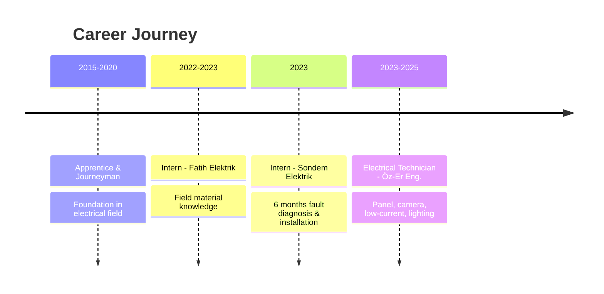

  <picture>
    <source media="(prefers-color-scheme: dark)" srcset="https://capsule-render.vercel.app/api?type=shark&height=320&color=gradient&customColorList=0,2,2,5,30&text=MUHAMMET%20ENES%20EVC%C4%B0&fontSize=44&fontAlignY=28&animation=twinkling&desc=%E2%9A%A1%20Electrical%20Technician%20%7C%20Control%20%26%20Automation%20%7C%20Software%20Developer%20%E2%9A%A1&descSize=15&descAlignY=52" />
    <source media="(prefers-color-scheme: light)" srcset="https://capsule-render.vercel.app/api?type=shark&height=320&color=gradient&customColorList=1,3,12,24&text=MUHAMMET%20ENES%20EVC%C4%B0&fontSize=44&fontAlignY=28&animation=twinkling&desc=%E2%9A%A1%20Electrical%20Technician%20%7C%20Control%20%26%20Automation%20%7C%20Software%20Developer%20%E2%9A%A1&descSize=15&descAlignY=52" />
    
  </picture>

 

  
  
  
  
   
  
  

---

<table align="center">
  <tr>
    <td align="center" width="96">
      
       Summary
    </td>
    <td align="center" width="96">
      
       Education
    </td>
    <td align="center" width="96">
      
       Experience
    </td>
    <td align="center" width="96">
      
       Skills
    </td>
    <td align="center" width="96">
      
       Certificates
    </td>
    <td align="center" width="96">
      
       Projects
    </td>
    <td align="center" width="96">
      
       References
    </td>
  </tr>
</table>

---

<h2 align="center">🧑‍💻 Personal Summary</h2>

  <pre style="background:#0d1117; padding: 20px; border-radius: 10px; border: 1px solid #30363d; text-align: left; display: inline-block;">
profile:
  name: Muhammet Enes
  surname: Evci
  title: Electrical Technician &amp; Software Developer
  location: Ankara, Türkiye

education:
  - Kırıkkale University → Control and Automation Technology
  - Abidinpaşa VTAHS → Electrical Panel Assembly

experience:
  electrical: 10+ years (Apprentice → Journeyman → Technician)
  software: 1+ year (Mobile, Embedded, AI)

focus_areas: [Embedded Systems, IoT, Mobile Development, AI]

goal: "Blending theoretical knowledge with field practice
          to create value-driven solutions"
  </pre>

---

<h2 align="center">🎓 Education</h2>

| | Degree | Institution | Department | Year |
|:-:|:------:|:-----------:|:----------:|:----:|
| 🎓 | **Associate Degree** | **Kırıkkale University** | Control and Automation Technology | `2024 – 2026` |
| 🏫 | **High School** | **Abidinpaşa VTAHS** | Electrical / Panel Assembly | `2019 – 2023` |

---

<h2 align="center">💼 Work Experience</h2>

| Period | Position | Company | Description |
|:-----:|:--------:|:-------:|:-----------|
| 🛠️ `2023 – 2025` | **Electrical Technician** | Öz-Er Engineering | Panel assembly/adjustment, cameras, low-current, cabling, lighting, troubleshooting |
| 🔧 `2023` | **Intern** | Sondem Elektrik / Ankara | 6 months field exp., fault diagnosis & repair, installation |
| 🔧 `2022 – 2023` | **Intern** | Fatih Elektrik / Ankara Ulus | Field applications, material knowledge |
| ⚡ `2015 – 2020` | **Apprentice – Journeyman** | Various Companies | Professional foundation and practice |

---

<h2 align="center">🛠️ Technical Skills</h2>

### ⚡ Panel & Electrical

![Motor Circuits](https://img.shields.io/badge/Motor_Circuits-555?style=for-the-badge&logo=data:image/svg%2bxml;base64,PHN2ZyB4bWxucz0iaHR0cDovL3d3dy53My5vcmcvMjAwMC9zdmciIHdpZHRoPSIxNiIgaGVpZ2h0PSIxNiIgZmlsbD0iI2ZmZiIgY2xhc3M9ImJpIGJpLXNlcnZvLW1vdG9yLWZpbGwiIHZpZXdCb3g9IjAgMCAxNiAxNiI+PHBhdGggZD0iTTkgM2MtMS4zNS4wNjMtMi4wMzguNzk3LTIuOTY0IDJsLjA5LjA4Yy0uNTIzLjU0Ny0uODUzIDEuMTg1LTEuMjA2IDEuODE3bC0uMDc4LjE1Yy0uNTQ4LjU0Ny0xLjE4Ny44NzgtMS44MjEgMS4yMjhsLS4wNzQuMDQzYzAgLjYyNS4wNjIgMS4yNjEuMzE2IDEuNzg0bC4wMzMuMDdjLjI1My41MjMuNzIuOTUyIDEuMjQyIDEuMjMybC4xNTQuMDg2Yy0uMDc4LjM5MS0uMTUzLjc4Mi0uMjI3IDEuMTczbC0uMDM2LjE4Yy0uMDUuMjM3LS4wOTcuNDczLS4xNDQuNzA5bC0uMDI1LjEzNWMtLjE5MyAxLjA3LS4yNDMgMS44NzUtLjA4NSAyLjQ2Ny4zMzYgMS4yNjYuOTgyIDIuMjUyIDIuMTMgMi41OTRhMS44IDEuOCAwIDAgMCAuNDcuMDc0Yy41NTcuMDYyIDEuMjE4oCTIDEuMDQzIDIuMDY2bC0uMzI4LS4wNDZhMi4wNiAyLjA2IDAgMCAwLS42MTQuMDE1Yy0uNjQzLjEwNi0xLjA5Ny4zODEtMS4zNC42NjctLjI0LjI4Mi0uMzM2LjYxLS4zNjIuOTM2YTEuNyAxLjcgMCAwIDAgLjA0NC40MzhsLjA1LjI3N2MuMDYuMzMyLjE2LjY4LjI5MiAxLjAzNkw5IDUuMjRjLS4xMzctLjM3My0uMjUtLjc1LS4zMTMtMS4xMmwtLjAyNS0uMTQ1QzguNTI4IDMuMzkgOC4zMDQgMi44MjYgOSAyLjl2LS4wMDVMOSAzem0tMyAxYy0uNjkgMC0xLjI1LjU2LTEuMjUgMS4yNXYzLjE3NWEzLjggMy44IDAgMCAxIDEuMjA2LS4zMTcgMS4zIDEuMyAwIDAgMC0uNDY0LS4yNjRsLS4zMDQtLjExN2EuNjUuNjUgMCAwIDEtLjQzOC0uNjE1VjQuMjVhLjI1LjI1IDAgMCAxIC4yNS0uMjV6bTIuNTQ3IDIuODQzYTIuMyAyLjMgMCAwIDAtLjI2Mi4xMjVsLS4xMzUuMDdMNiA4LjI3bC4zNzUuNjI1LjE1LS4wNmMuMTYtLjA2Ni4zMy0uMTE3LjUtLjE2YTEuMjUgMS4yNSAwIDAgMSAuNDc4LS4wNDdjMS4wMjMuMDggMS43ODUuNjA2IDIuMjY2IDEuNDJsLjI1Mi4zNzQuMjA3LS4yMDZhLjUuNSAwIDAgMCAwLS43MDdsLTEuMTc1LTEuMTc1YTEuMjUgMS4yNSAwIDAgMC0uODg0LS4zNjZ6bS0yLjYyLjMxN2MtLjMzLjA0Ni0uNjQuMTMtLjkzNy4yMzRhMS4zOCAxLjM4IDAgMCAwLS4zNy4yMTJsLS4zMDMuMjUtLjA3LjA3Yy0uMzM1LjMzOC0uNTY1Ljc2Mi0uNzA5IDEuMjE3bC0uMDUuMTUyYzAgLjAxOC0uMDA1LjAzNi0uMDA4LjA1M2wuNDc4LjYzNGEuMjUuMjUgMCAwIDAgLjM5Mi4wMjRsMS4yNTMtMS40NTJjLjI1OC0uMjU3LjQ1LS41NjUuNTgtLjkwMS4wNC4wMzUuMDguMDcuMTI1LjEwM2wuMTUuMTI1YTEuNzUgMS43NSAwIDAgMSAuNTIuNjczYy4wNzQuMTUzLjEyNi4zMTYuMTU1LjQ4N2ExLjUgMS41IDAgMCAxLS4zLjU3N2MtLjM0LjM5Ny0uODI3LjU5OC0xLjM2Ny43Mi0uMjU3LjA2LS41MjkuMDg3LS43OTguMTA4YTEuNDggMS40OCAwIDAgMCAuNTQ3LjM3OGwuMTU0LjA2Mi4wNTIuMDIxYy40MC4xNTYuODEuMjM1IDEuMjIuMjM1bC4yNTgtLjAxM2MuMDI2IDAgLjA1LS4wMDQuMDc2LS4wMDYuMjkzLS4wMDIuNTg2LS4wNDMuODctLjEyNS4xMzQtLjAzNy4yNjUtLjA4LjM5Mi0uMTN6bS43NDUtLjAxOGMuMTUtLjA1Ny4zLS4xMjIuNDM2LS4xOTdhMi4yIDIuMiAwIDAgMCAuMzU2LS4yMzdsLjE4NS0uMTU0LS4yMTYtLjI3YTIuNCAyLjQgMCAwIDAtLjU5LS41MiAxLjMgMS4zIDAgMCAwLS4zMy0uMTVsLS4yMi0uMDU2Yy0uMDI0LjA2LS4wNS4xMi0uMDc4LjE3N2wtLjA3Ni4xNjVjLS4xMjMuMjQ1LS4yODMuNDYzLS40NzUuNjQ3bDEuMDI4LjQ5NXptLTQuNjUuMzV2MS42NjZhLjI1LjI1IDAgMCAwIC4yNS4yNUg0LjVjLjI2MyAwIC40OTUtLjE2LjU5LS4zOTZsLS4wMDctLjAxNmEuNjIuNjIgMCAwIDEtLjI5Ni0uMjA0TDMuNjcyIDcuNTh6Ii8+PC9zdmc+)

### 💻 Programming

### 🤖 Embedded / IoT

### 📱 Mobile Development

### 🎨 Design & CAD

### 🧠 AI / LLM

---

<h2 align="center">📜 Certificates</h2>

| Year | Certificate | Provider |
|:----:|:----------:|:--------:|
| ✅ `2025` | **C Programming Language** |  |
| ✅ `2025` | **Introduction to Data Science** |  |

---

<h2 align="center">🌐 Languages</h2>

| Language | Level |
|:--------:|:-----:|
| 🇹🇷 **Turkish** | `Native` 👑 |
| 🇬🇧 **English** | `B1 (Intermediate)` 📘 |

---

<h2 align="center">📱 Project Portfolio</h2>

<b>🤖 AI & Agent Systems</b>

 

| Project | Description | Stack |
|:--------|:-----------|:------|
| 🧠 **[Agent Army](Agent-army/)** | 30 AI coding agents, bilingual (EN/TR), 4 plugins. Code review, security, DevOps, test, UI design. | `pixi AI` `JavaScript` |
| 🗣️ **[Pixi AI Assistant v3](pixi-ai-assistant-v3/)** | ESP32-S2 AI voice assistant: NTP clock, forex, crypto, Google Apps Script, Gemini API. | `ESP32` `Arduino` `C++` |
| 📱 **[OpenCode Mobile](OpenCode-Mobile/)** | OpenCode AI mobile web client: landing, main interface, widgets. | `Nitron` `HTML/CSS/JS` |
| 🤖 **[OpenCode Android](opencode-android/)** | OpenCode native Android: chat, terminal, file explorer, onboarding. | `Kotlin` `Jetpack Compose` |

<b>📚 Education</b>

 

| Project | Description | Stack |
|:--------|:-----------|:------|
| 🚗 **[Driver's Exam App](ehliyet-uygulamasi/)** | 142 questions (4 categories), timed mode, progress tracking. | `Capacitor` `Nitron` `HTML/CSS/JS` |
| 📱 **[Driver's Exam Expo](ehliyet-expo/)** | React Native version using WebView. | `React Native` `Expo` |

<b>🕌 Islamic Lifestyle</b>

 

| Project | Description | Stack |
|:--------|:-----------|:------|
| 🕌 **[EZANTAKİPPRO](ezan-takip/)** | 6 prayers, 85 duas (16 categories), 5 dhikr counters, Qibla compass, AI Quran assistant, 25 cities 62 districts. | `React Native` `Expo` `TypeScript` |

<b>🏦 Finance</b>

 

| Project | Description | Stack |
|:--------|:-----------|:------|
| 💰 **[FinWise](finwise/)** | Dashboard, transactions, budget & goal management. | `Kotlin` `Jetpack Compose` `Material 3` |

<b>⚖️ Legal</b>

 

| Project | Description | Stack |
|:--------|:-----------|:------|
| ⚖️ **[LegalAI](legalai/)** | Case tracking, client management, hearing calendar, document management. | `Kotlin` `Jetpack Compose` `Material 3` |

<b>🌿 Environment</b>

 

| Project | Description | Stack |
|:--------|:-----------|:------|
| 🌍 **[EcoTrack](ecotrack/)** | Ecological footprint tracking and environmental management. | `Kotlin` `Jetpack Compose` `Material 3` |

<b>🏠 Augmented Reality & Design</b>

 

| Project | Description | Stack |
|:--------|:-----------|:------|
| 🪑 **[AR Interiors](ar-interiors/)** | ARCore furniture preview, gallery save. | `Kotlin` `ARCore` `SceneView` |
| 🎨 **[Design Assets](desing/)** | UI/UX mockups and SVG assets. | `HTML` `CSS` `JS` |

<b>🔌 IoT & Embedded</b>

 

| Project | Description | Stack |
|:--------|:-----------|:------|
| 🛠️ **[pixiZ v1](pixiZ-v1/)** | Flipper Zero inspired multi-tool: Wi-Fi, BLE, IR, BadUSB, password manager, QR. | `ESP32` `Arduino` `C++` |
| 📡 **[IR Remote](ir-remote/)** | ESP32 universal IR remote: TFT display, learning, 50 memory, 6 protocols. | `ESP32` `Arduino` `C++` |
| 🔬 **[MicroUno](microuno/)** | Android Arduino/AVR simulator: AVR emulation, code editor, serial terminal. | `Kotlin` `C/C++` `NDK` |

---

<h2 align="center">📞 References</h2>

| Name | Title | Contact |
|:-----|:------|:--------|
| **Tamer Özbek** | Electrical Engineer | <a href="tel:+905333131440"><code>📞 +90 533 313 14 40</code></a> |
| **Nuri Alper Metin** | Lecturer, Kırıkkale University | <a href="mailto:nurialpermetin@kku.edu.tr"><code>📧 nurialpermetin@kku.edu.tr</code></a> · <a href="tel:+905466928884"><code>📞 +90 546 692 88 84</code></a> |
| **Prof. Dr. R. Gökhan Türeci** | Head of Dept., Kırıkkale University | <a href="mailto:turici@kku.edu.tr"><code>📧 turici@kku.edu.tr</code></a> · <a href="tel:+905326594936"><code>📞 +90 532 659 49 36</code></a> |

---

  <picture>
    <source media="(prefers-color-scheme: dark)" srcset="https://capsule-render.vercel.app/api?type=waving&color=gradient&height=130&section=footer" />
    <source media="(prefers-color-scheme: light)" srcset="https://capsule-render.vercel.app/api?type=waving&color=gradient&height=130&section=footer&color=0,2,55" />
    
  </picture>
    
  <table>
    <tr>
      <td align="center"><b>📧</b></td>
      <td><a href="mailto:muhammetenesevci@gmail.com">muhammetenesevci@gmail.com</a></td>
    </tr>
    <tr>
      <td align="center"><b>📞</b></td>
      <td><a href="tel:+905076574948">+90 507 657 4948</a></td>
    </tr>
    <tr>
      <td align="center"><b>🐙</b></td>
      <td><a href="https://github.com/azerenes">github.com/azerenes</a></td>
    </tr>
  </table>
   
  📌 Last Updated: 2026 · Muhammet Enes Evci
    
  
  

